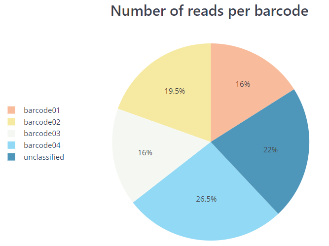

# nf-core/nanoseq: Output

## :warning: Please read this documentation on the nf-core website: [https://nf-co.re/nanoseq/output](https://nf-co.re/nanoseq/output)

## Introduction

This document describes the output produced by the pipeline. Most of the plots are taken from the MultiQC report, which summarises results at the end of the pipeline.

## Pipeline overview

The pipeline is built using [Nextflow](https://www.nextflow.io/). See [`main README.md`](../README.md) for a condensed overview of the steps in the pipeline, and the bioinformatics tools used at each step.

See [Oxford NanoPore website](https://nanoporetech.com/) for more information regarding the sequencing technology, protocol, and for an extensive list of resources.

The directories listed below will be created in the output directory after the pipeline has finished. All paths are relative to the top-level results directory.

## Basecalling and demultiplexing

Output files

* `guppy/fastq/`
    Merged fastq output files for each barcode.
* `guppy/basecalling/<barcode*>/`
    fastq output files for each barcode.
* `guppy/basecalling/unclassified/`
    fastq files with reads were unassigned to any given barcode.
* `guppy/basecalling/sequencing_summary.txt`
    Sequencing summary file generated by *Guppy*.
* `guppy/basecalling/sequencing_telemetry.js`
    Sequencing telemetry file generated by *Guppy*.
* `guppy/basecalling/guppy_basecaller_log-<date>.log`
    Log file for *Guppy* execution.
* `qcat/fastq/<barcode*>.fastq.gz`
    fastq output files for each barcode.
* `qcat/fastq/none.fastq.gz`
    fastq file with reads were unassigned to any given barcode.

*Documentation*:
[Guppy](https://nanoporetech.com/nanopore-sequencing-data-analysis), [qcat](https://github.com/nanoporetech/qcat)

*Description*:
The pipeline has been written to deal with the various scenarios where you would like to include/exclude the basecalling and demultiplexing steps. This will be dependent on what type of input data you would like to provide the pipeline. Additionally, if you would like to align your samples to a reference genome there are various options for providing this information. Please see [`usage.md`](usage.md#--input) for more details about the format of the input samplesheet, associated commands and how to provide reference genome data.

*Guppy* will be used to basecall and demultiplex the data. Various options have been provided to customise specific parameters and to be able to run *Guppy* on GPUs.

If you have a pre-basecalled fastq file then *qcat* will be used to perform the demultiplexing if you provide the `--skip_basecalling` parameter. If you would like to skip both of these steps entirely then you can provide `--skip_basecalling --skip_demultiplexing` when running the pipeline. As a result, the structure of the output folder will depend on which steps you have chosen to run in the pipeline.

## Removal of DNA contaminants

Output files

* `nanolyse/<SAMPLE>.clean.fastq.gz`
    FastQ file after the removal of reads mapping to DNA contaminants.

*Documentation*:
[NanoLyse](https://github.com/wdecoster/nanolyse)

*Description*:
If you would like to run NanoLyse on the raw FastQ files then you can provide `--run_nanolyse` when running the pipeline. By default, the pipeline will filter the raw reads relative to lambda phage but you can provide your own fasta file of "contaminants" with `--nanolyse_fasta`. The filtered FastQ files will contain raw reads without the provided reference sequences (default: lambda phage sequences).

## Sequencing QC

Output files

* `pycoqc/pycoqc.html`
    `*.html` file that includes a run summary and graphical representation of various QC metrics including distribution of read length, distribution of read quality scores, mean read quality per sequence length, output per channel over experiment time and percentage of reads per barcode.
* `nanoplot/summary/`
    `*.html` files for QC metrics and individual `*.png` image files for plots.

*Documentation*:
[PycoQC](https://github.com/a-slide/pycoQC), [NanoPlot](https://github.com/wdecoster/NanoPlot)

*Description*:
*PycoQC* and *NanoPlot* compute metrics and generate QC plots using the sequencing summary information generated by *Guppy* e.g. distribution of read length, read length over time, number of reads per barcode and other general stats. *NanoPlot* also generates QC metrics directly from fastq files as described in the next section.

## Read QC

Output files

* `nanoplot/fastq/<SAMPLE>/`
    Per-sample `*.html` files for QC metrics and individual `*.png` image files for plots.
* `fastqc/`
    *FastQC* `*.html` and `*.zip` files.

*Documentation*:
[NanoPlot](https://github.com/wdecoster/NanoPlot), [FastQC](http://www.bioinformatics.babraham.ac.uk/projects/fastqc/Help/)

*Description*:
*NanoPlot* can also be used to produce general quality metrics from the per-barcode fastq files generated by *Guppy* e.g. quality score distribution, read lengths and other general stats.

*FastQC* gives general quality metrics about your reads. It provides information about the quality score distribution across your reads, the per base sequence content (%A/C/G/T). You get information about adapter contamination and other overrepresented sequences.

## Alignment

Output files

* `<ALIGNER>/bam`
    Per-sample coordinate sorted alignment files in [`*.bam`](https://samtools.github.io/hts-specs/SAMv1.pdf) format.
* `<ALIGNER>/bam_index`
    Per-sample coordinate sorted alignment index files in [`*.bai`](https://samtools.github.io/hts-specs/SAMv1.pdf) format.
* `<ALIGNER>/samtools_stats/`
    *SAMtools* `*.flagstat`, `*.idxstats` and `*.stats` files generated from the alignment files.

*Documentation*:
[GraphMap2](https://github.com/lbcb-sci/graphmap2), [MiniMap2](https://github.com/lh3/minimap2), [SAMtools](http://samtools.sourceforge.net/)

*Description*:
Reads are mapped to a user-defined genome or transcriptome using either *GraphMap2* or *Minimap2*, and the resulting BAM files are sorted and indexed. If the same reference is specified multiple times in the input sample sheet then the aligner index will only be built once for re-use across all samples. You can skip the alignment and downstream processes by providing the `--skip_alignment` parameter.

The initial SAM alignment files created by *GraphMap2* or *Minimap2* are not saved by default to be more efficient with storage space. You can override this behaviour with the use of the `--save_align_intermeds` parameter.

## Coverage tracks

Output files

* `<ALIGNER>/bigwig/`
    Per-sample `*.bigWig` files.
* `<ALIGNER>/bigbed/`
    Per-sample `*.bigBed` files.

*Documentation*:
[BEDTools](https://bedtools.readthedocs.io/en/latest/), [bedGraphToBigWig](https://genome.ucsc.edu/goldenpath/help/bigWig.html#Ex3), [`bedToBigBed`](https://genome.ucsc.edu/goldenPath/help/bigBed.html#Ex2)

*Description*:
The [bigWig](https://genome.ucsc.edu/goldenpath/help/bigWig.html) format is in an indexed binary format useful for displaying dense, continuous data in Genome Browsers such as the [UCSC](https://genome.ucsc.edu/cgi-bin/hgTracks) and [IGV](http://software.broadinstitute.org/software/igv/). This mitigates the need to load the much larger BAM files for data visualisation purposes which will be slower and result in memory issues. The bigWig format is also supported by various bioinformatics software for downstream processing such as meta-profile plotting.

[bigBed](https://genome.ucsc.edu/goldenPath/help/bigBed.html) are more useful for displaying distribution of reads across exon intervals as is typically observed for RNA-seq data. Therefore, these files will only be generated if `--protocol directRNA` or `--protocol cDNA` are defined.

The creation of these files can be bypassed by setting the parameters `--skip_bigwig`/`--skip_bigbed`.

## Transcript Reconstruction and Quantification

Output files

If bambu is used:

* `bambu/`
    * `extended_annotations.gtf` - a gtf file that contains both annotated and novel transcripts
    * `counts_gene.txt` - gene expression estimates
    * `counts_transcript.txt` - transcript expression estimates

If StringTie2 is used:

* `stringtie2/`
    * `*.bam`
        Per-sample coordinate sorted alignment files in [`*.bam`](https://samtools.github.io/hts-specs/SAMv1.pdf) format.
    * `*.stringtie.gtf`
        Per-sample annotations for novel transcripts obtained in *StringTie2*.
    * `stringtie.merged.gtf`
        Extended annotation that combines provided gtf with gtf files from each sample via *StringTie2 Merge*.
    * `counts_gene.txt` - gene expression estimates calculated by featureCounts.
    * `counts_gene.txt.summary` - featureCounts gene level log file.
    * `counts_transcript.txt` - transcript expression estimates calculated by featureCounts.
    * `counts_transcript.txt.summary` - featureCounts transcript level log file.

*Documentation*:
[bambu](https://bioconductor.org/packages/release/bioc/html/bambu.html), [StringTie2](https://ccb.jhu.edu/software/stringtie/), [featureCounts](http://bioinf.wehi.edu.au/featureCounts/)

*Description*:
After genomic alignment, novel transcripts can be reconstructed using tools such as bambu and StringTie2. Quantification can then be performed on a more complete annotation based on the transcripts detected within a given set of samples. bambu performs both the reconstruction and quantification steps. An an alternative approach, we also provides an option to run StringTie2 to identify novel transcripts. However, when multiple samples are provided, quantification for multiple samples are not implemented explicitly in the software. Hence a second step is required to merge novel transcripts across multiple samples followed by quantification for both gene and transcripts using featureCounts. You can skip transcript reconstruction and quantification by providing the `--skip_quantification` parameter.

## Differential expression analysis

Output files

* `<QUANTIFICATION_METHOD>/deseq2/deseq2.results.txt` - a `.txt` file that can contains differential expression results for genes.
* `<QUANTIFICATION_METHOD>/dexseq/dexseq.results.txt` - a `.txt` file that can contains differential expression results for transcripts.

*Documentation*:
[DESeq2](https://bioconductor.org/packages/release/bioc/html/DESeq2.html), [DEXSeq](https://bioconductor.org/packages/release/bioc/html/DEXSeq.html)

*Description*:
If multiple conditions and multiple replicates are available then the pipeline is able to run differential analysis on gene and transcripts with DESeq2 and DEXSeq, respectively. These steps won't be run if you provide the `--skip_quantification` or `--skip_differential_analysis` parameters or if all of the samples in the samplesheet don't have the same fasta and GTF reference files.

## Variant calling

Output files

* `minimap2/medaka/<SAMPLE>/round_1.vcf        `
    VCF file with small variants for each sample.
* `minimap2/sniffles/<sample>_sniffles.vcf`
    VCF files with unflitered structural variants.

*Documentation*:
[Medaka](https://github.com/nanoporetech/medaka), [Sniffles](https://github.com/fritzsedlazeck/Sniffles)

*Description*:
If the protocol is set to `--protocol DNA` and the *Minimap2* aligner was used, then the `--call_variants` parameter can be invoked to call small variants and structural variants using Medaka and Sniffles, respectively. These steps won't be run if you provide the `--skip_medaka` or `--skip_sniffles` parameters.

## MultiQC

Output files

* `multiqc/`
    * `multiqc_report.html` - a standalone HTML file that can be viewed in your web browser.
    * `multiqc_data/` - directory containing parsed statistics from the different tools used in the pipeline.
    * `multiqc_plots/` - directory containing static images from the report in various formats.

*Documentation*:
[MultiQC](https://multiqc.info/docs/)

*Description*:
*MultiQC* is a visualisation tool that generates a single HTML report summarising all samples in your project. Most of the pipeline QC results are visualised in the report and further statistics are available within the report data directory.

Results generated by *MultiQC* for this pipeline collate QC from *FastQC*, *samtools flagstat*, *samtools idxstats* and *samtools stats*.

The pipeline has special steps which also allow the software versions to be reported in the *MultiQC* output for future traceability. For more information about how to use *MultiQC* reports, see <http://multiqc.info>.

## Pipeline information

Output files

* `pipeline_info/`
    * Reports generated by Nextflow: `execution_report.html`, `execution_timeline.html`, `execution_trace.txt` and `pipeline_dag.dot`/`pipeline_dag.svg`.
    * Reports generated by the pipeline: `pipeline_report.html`, `pipeline_report.txt` and `software_versions.yml`. The `pipeline_report*` files will only be present if the `--email` / `--email_on_fail` parameter's are used when running the pipeline.
    * Reformatted samplesheet files used as input to the pipeline: `samplesheet.valid.csv`.

*Documentation*:
[Nextflow](https://www.nextflow.io/docs/latest/tracing.html)

*Description*:
*Nextflow* provides excellent functionality for generating various reports relevant to the running and execution of the pipeline. This will allow you to trouble-shoot errors with the running of the pipeline, and also provide you with other information such as launch commands, run times and resource usage.
