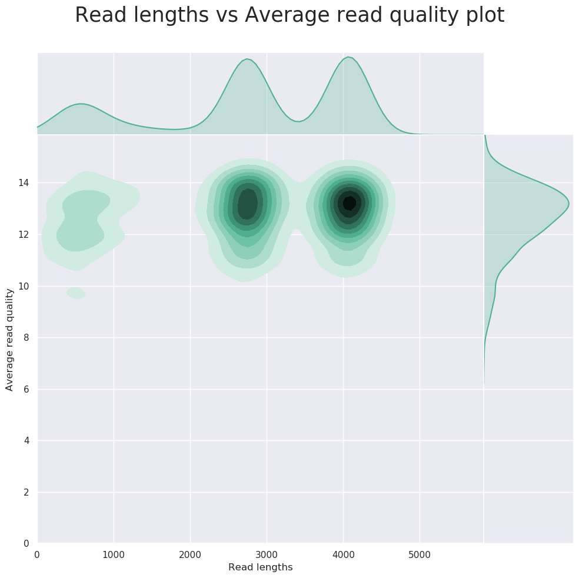
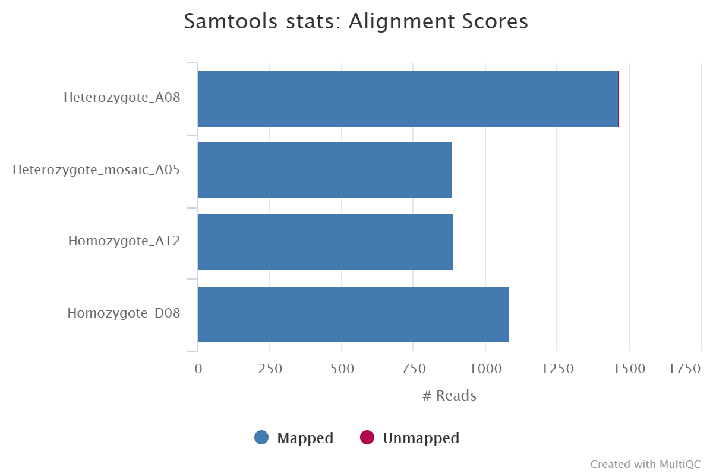

# nf-core/nanoseq: Output

## :warning: Please read this documentation on the nf-core website: [https://nf-co.re/nanoseq/output](https://nf-co.re/nanoseq/output)

## Introduction

This document describes the output produced by the nf-core/nanoseq pipeline. Most of the plots shown here are taken from the MultiQC report, which summarises the pipeline results.

## Pipeline overview

The nf-core/nanoseq pipeline is built using [Nextflow](https://www.nextflow.io/). There are many different potential outputs for the pipeline depending on what file inputs and parameters you use. Please see [`main README.md`](../README.md) for a condensed overview of the steps in the pipeline and the bioinformatics tools used at each step.

See [Oxford NanoPore website](https://nanoporetech.com/) for more information regarding the sequencing technology, protocol, and for an extensive list of additional resources.

The directories listed below are created in the output directory after the pipeline has finished. All paths are relative to the top-level results directory.

## Demultiplexing

Output files

- `qcat/fastq/<barcode*>.fastq.gz`: FASTQ output files for each barcode.
- `qcat/fastq/none.fastq.gz`: FASTQ file with reads were unassigned to any given barcode.

_Documentation_:
[qcat](https://github.com/nanoporetech/qcat)

_Description_:
Nanoseq is designed to deal with various input data types. Pre-basecalled FASTQ file can be demuliplexed using _qcat_. Please see [`usage.md`](usage.md#--input) for more details about the format of the input samplesheet. All potential outputs are shown here however some may not be produced depending on your inputs and the steps you have chosen to run.

## Removal of DNA contaminants

Output files

- `nanolyse/<SAMPLE>.fastq.gz`: FASTQ file after the removal of reads that map to DNA contaminants.
- `nanolyse/<SAMPLE>.nanolyse.log`: NanoLyse log file.

_Documentation_:
[NanoLyse](https://github.com/wdecoster/nanolyse)

_Description_:
If you would like to run NanoLyse on the raw FASTQ files you can provide `--run_nanolyse` when running the pipeline. By default, the pipeline will filter lambda phage reads. However, you can provide your own FASTA file of "contaminants" with `--nanolyse_fasta`. The filtered FASTQ files will contain raw reads without the specified reference sequences (default: lambda phage sequences).

## Read QC

Output files

- `nanoplot/fastq/<SAMPLE>/`: directory with various `*.html` files containing QC metrics and plots.
- `fastqc/<SAMPLE>_fastqc.html`: _FastQC_ `*.html` file for each sample.
- `fastqc/<SAMPLE>_fastqc.zip`: _FastQC_ `*.zip` file for each sample.

_Documentation_:
[NanoPlot](https://github.com/wdecoster/NanoPlot), [FastQC](http://www.bioinformatics.babraham.ac.uk/projects/fastqc/Help/)

_Description_:
_NanoPlot_ can be used to produce general quality metrics from the per barcode FASTQ files generated by a basecaller e.g. quality score distribution, read lengths, and other general stats.

_FastQC_ can give general quality metrics about your reads. It can provide information about the quality score distribution across your reads, and the per-base sequence content (%A/C/G/T). You can also generate information about adapter contamination and other over-represented sequences.

## Alignment

Output files

- `<ALIGNER>/<SAMPLE>.sorted.bam`: per sample coordinate sorted BAM file.
- `<ALIGNER>/<SAMPLE>.sorted.bam.bai`: per sample coordinate sorted BAM index file.
- `<ALIGNER>/samtools_stats/`: directory with per sample `*.flagstat`, `*.idxstats` and `*.stats` files generated by _Samtools_.

_Documentation_:
[GraphMap2](https://github.com/lbcb-sci/graphmap2), [MiniMap2](https://github.com/lh3/minimap2), [Samtools](http://samtools.sourceforge.net/)

_Description_:
Reads are mapped to a user-defined genome or transcriptome using either _GraphMap2_ or _Minimap2_. The resulting BAM file is sorted and indexed using _Samtools_. If the same reference is specified multiple times in the input sample sheet then the aligner index will only be built once for re-use across all samples. You can skip the alignment and downstream processes by providing the `--skip_alignment` parameter.

The initial SAM alignment file created by _GraphMap2_ or _Minimap2_ are not saved by default to be more storage space efficient. You can override this behaviour by using the `--save_align_intermeds` parameter.

## Coverage tracks

Output files

- `<ALIGNER>/bigwig/`: directory with per sample `*.bigWig` and `*.bedGraph` file.
- `<ALIGNER>/bigbed/`: directory with per sample `*.bigBed` and `*bed12` file.

_Documentation_:
[BEDTools](https://bedtools.readthedocs.io/en/latest/), [bedGraphToBigWig](https://genome.ucsc.edu/goldenpath/help/bigWig.html#Ex3), [`bedToBigBed`](https://genome.ucsc.edu/goldenPath/help/bigBed.html#Ex2)

_Description_:
The [bigWig](https://genome.ucsc.edu/goldenpath/help/bigWig.html) format is an indexed binary format useful for displaying dense, continuous data in Genome Browsers such as the [UCSC](https://genome.ucsc.edu/cgi-bin/hgTracks) and [IGV](http://software.broadinstitute.org/software/igv/). This mitigates the need to load the much larger BAM file for data visualisation purposes which will be slower and result in memory issues. The bigWig format is also supported by various bioinformatics software for downstream processing such as meta-profile plotting.

[bigBed](https://genome.ucsc.edu/goldenPath/help/bigBed.html) are more useful for displaying distribution of reads across exon intervals as is typically observed for RNA-seq data. Therefore, these files will only be generated if `--protocol directRNA` or `--protocol cDNA` are defined.

The creation of these bigwig and bigbed files can be bypassed by setting the `--skip_bigwig` and `--skip_bigbed` parameters, respectively.

## Variant calling

Output files

Short variant callers

- Medaka:

  - `variant_calling/medaka_variant/<SAMPLE>.vcf.gz`: zipped VCF file with small variants.
  - `variant_calling/medaka_variant/<SAMPLE>.vcf.gz`: index for zipped VCF file with small variants.

- DeepVariant:

  - `variant_calling/deepvariant/<SAMPLE>.vcf.gz`: zipped VCF file with small variants.
  - `variant_calling/deepvariant/<SAMPLE>.vcf.gz.tbi`: index for zipped VCF file with small variants.

- PEPPER-Margin-DeepVariant:
  - `variant_calling/margin_pepper_deepvariant/<SAMPLE>.vcf.gz`: zipped VCF file with small variants.
  - `variant_calling/margin_pepper_deepvariant/<SAMPLE>.vcf.gz.tbi`: index for zipped VCF file with small variants.

Structural variant callers

- Sniffles

  - `variant_calling/cutesv/<SAMPLE>.vcf.gz`: zipped VCF file with smtructural variants.
  - `variant_calling/cutesv/<SAMPLE>.vcf.gz.tbi`: index for zipped VCF file with structural variants.

- cuteSV
  - `variant_calling/sniffles/<SAMPLE>.vcf.gz`: zipped VCF file with smtructural variants.
  - `variant_calling/sniffles/<SAMPLE>.vcf.gz.tbi`: index for zipped VCF file with structural variants.

_Documentation_:
[Medaka](https://github.com/nanoporetech/medaka), [DeepVariant](https://github.com/google/deepvariant), [PEPPER-Margin-DeepVariant](https://github.com/kishwarshafin/pepper),
[Sniffles](https://github.com/fritzsedlazeck/Sniffles), [cuteSV](https://github.com/tjiangHIT/cuteSV)

_Description_:
If the `--protocol DNA` and the `--call_variants` parameters are defined then both small and structural variant variant calls can be generated.
Short variants can be called using _medaka_, _deepvariant_ or _pepper_margin_deepvariant_. The short variant caller is specified using the `--variant_caller` parameter.
Structural variants can be called using either _cuteSV_ or _sniffles_. The structural variant caller is specified using the `--structural_variant_caller` parameter.
The short variant and/or structural variant calling steps is skipped if using the `--skip_vc` and `--skip_sniffles` flags.

## Transcript Reconstruction and Quantification

Output files

If bambu is used:

- `bambu/`
  - `extended_annotations.gtf`: a GTF file that contains both annotated and novel transcripts.
  - `counts_gene.txt`: a TXT file containing gene expression estimates.
  - `counts_transcript.txt`: a TXT file containing transcript expression estimates.

If StringTie2 is used:

- `stringtie2/`
  - `*.bam`: per sample coordinate sorted alignment file.
  - `*.stringtie.gtf`: per sample annotations for novel transcripts obtained in _StringTie2_.
  - `stringtie.merged.gtf`: extended annotation that combines provided GTF with GTF file from each sample via _StringTie2 Merge_.
  - `counts_gene.txt`: gene expression estimates calculated by featureCounts.
  - `counts_gene.txt.summary`: FeatureCounts gene level log file.
  - `counts_transcript.txt`: transcript expression estimates calculated by featureCounts.
  - `counts_transcript.txt.summary`: FeatureCounts transcript level log file.

_Documentation_:
[bambu](https://bioconductor.org/packages/release/bioc/html/bambu.html), [StringTie2](https://ccb.jhu.edu/software/stringtie/), [featureCounts](http://bioinf.wehi.edu.au/featureCounts/)

_Description_:
After genomic alignment, novel transcripts can be reconstructed using tools such as bambu and StringTie2. Quantification can then be performed on a more complete annotation based on the transcripts detected within a given set of samples. bambu performs both the reconstruction and quantification steps. An an alternative approach, we also provides an option to run StringTie2 to identify novel transcripts. However, when multiple samples are provided, quantification for multiple samples are not implemented explicitly in the software. Hence a second step is required to merge novel transcripts across multiple samples followed by quantification for both gene and transcripts using featureCounts. You can skip transcript reconstruction and quantification by providing the `--skip_quantification` parameter.

## Differential expression analysis

Output files

- `<QUANTIFICATION_METHOD>/deseq2/deseq2.results.txt`: a TXT file that contains differential gene expression.
- `<QUANTIFICATION_METHOD>/dexseq/dexseq.results.txt`: a TXT file that contains differential transcript expression.

_Documentation_:
[DESeq2](https://bioconductor.org/packages/release/bioc/html/DESeq2.html), [DEXSeq](https://bioconductor.org/packages/release/bioc/html/DEXSeq.html)

_Description_:
If multiple conditions and multiple replicates are available then the pipeline is able to run differential analysis on gene and transcripts with DESeq2 and DEXSeq, respectively. These steps won't be run if you provide the `--skip_quantification` or `--skip_differential_analysis` parameters or if all of the samples in the samplesheet don't have the same FASTA and GTF reference files.

## RNA modification analysis

Output files

- `rna_modifications/xpore/diffmod/diffmod_outputs/diffmod.table`: a table file that contains differentially modified sites.
- `rna_modifications/m6anet/inference/<sample_name>/data.result.csv.gz`: a CSV file that contains m6A sites.

_Documentation_:
[xPore](https://xpore.readthedocs.io/en/latest/), [m6anet](https://m6anet.readthedocs.io/en/latest/)

_Description_:
If multiple conditions are available then the pipeline is able to run differential modification analysis with xPore. These steps won't be run if you provide the `--skip_modification_analysis` or `--skip_xpore` or `--skip_m6anet` parameters.

## RNA fusion analysis

Output files

- `jaffal/jaffa_results.csv`: a CSV file that contains RNA fusion results.
- `jaffal/jaffa_results.fasta`: a FASTA file that contains the sequence of the RNA fusions.

_Documentation_:
[jaffal](https://github.com/Oshlack/JAFFA/wiki)

_Description_:
This step won't be run if you provide the `--skip_fusion_analysis` parameter.

## MultiQC

Output files

- `multiqc/`
  - `multiqc_report.html`: a standalone HTML file that can be viewed in your web browser.
  - `multiqc_data/`: a directory containing parsed statistics from the different tools used in the pipeline.
  - `multiqc_plots/`: a directory containing static images from the report in various formats.

_Documentation_:
[MultiQC](https://multiqc.info/docs/)

_Description_:
_MultiQC_ is a visualisation tool that generates a single HTML report summarising all samples in your project. Most of the pipeline QC results are visualised in the report and further statistics are available within the report data directory.

Results generated by _MultiQC_ for this pipeline collate QC from _FastQC_, _samtools flagstat_, _samtools idxstats_ and _samtools stats_.

The pipeline has special steps which also allow the software versions to be reported in the _MultiQC_ output for future traceability. For more information about how to use _MultiQC_ reports, see <http://multiqc.info>.

## Pipeline information

Output files

- `pipeline_info/`
  - Reports generated by Nextflow: `execution_report.html`, `execution_timeline.html`, `execution_trace.txt` and `pipeline_dag.dot`/`pipeline_dag.svg`.
  - Reports generated by the pipeline: `pipeline_report.html`, `pipeline_report.txt` and `software_versions.yml`. The `pipeline_report*` file will only be present if the `--email` / `--email_on_fail` parameter's are used when running the pipeline.
  - Reformatted samplesheet file used as the pipeline input: `samplesheet.valid.csv`.

_Documentation_:
[Nextflow](https://www.nextflow.io/docs/latest/tracing.html)

_Description_:
_Nextflow_ provides excellent functionality for generating various reports relevant to the running and execution of the pipeline. This will allow you to trouble-shoot errors with the running of the pipeline, and also provide you with other information such as launch commands, run times and resource usage.
